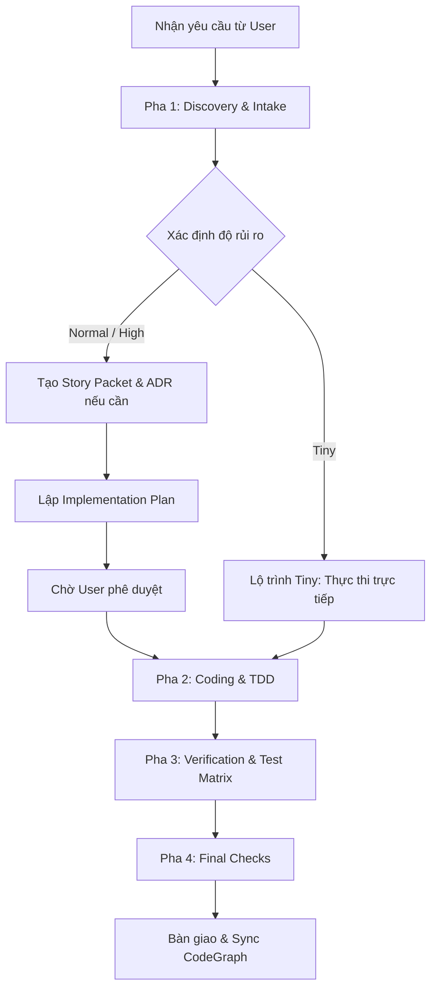

# Quy trình Vận hành của Agent (Agent Lifecycle Flow)

Tài liệu này mô tả chi tiết quy trình vận hành khép kín của AI Agent khi nhận và xử lý một tác vụ trong repository `flora-core`. Quy trình bao gồm 4 pha chính nhằm đảm bảo tính an toàn, nhất quán và chất lượng mã nguồn.



---

## PHA 1: DISCOVERY & INTAKE (Khảo sát & Tiếp nhận)

1. **Đồng bộ hóa CodeGraph**:
   - Agent chạy `codegraph sync` ngay khi bắt đầu phiên làm việc để hiểu cấu trúc các symbol và mối quan hệ phụ thuộc trong dự án.
2. **Feature Intake Gate ([FEATURE_INTAKE.md](file:///c:/Users/T/.gemini/antigravity/scratch/flora-core/docs/FEATURE_INTAKE.md))**:
   - Agent tự động phân tích và xếp loại tác vụ thành 3 mức độ rủi ro:
     - **Tiny**: Sửa typo, tinh chỉnh giao diện nhỏ, thêm comment, refactor nhỏ trong phạm vi 1 file.
     - **Normal**: Thêm API endpoint mới, sửa logic tính toán, viết bổ sung test, thêm cấu hình.
     - **High-Risk**: Thay đổi schema cơ sở dữ liệu, tích hợp thanh toán, thay đổi cơ chế Auth, nâng cấp thư viện lớn.
   - Đối với mức **Normal** hoặc **High-Risk**, Agent bắt buộc phải khởi tạo một Story Packet tại `docs/stories/S-NNN-short-title.md` (dựa trên mẫu `story.md`) để liệt kê các file bị ảnh hưởng và xây dựng kế hoạch kiểm thử sơ bộ.
3. **Context Engineering ([CONTEXT_RULES.md](file:///c:/Users/T/.gemini/antigravity/scratch/flora-core/docs/CONTEXT_RULES.md))**:
   - Agent áp dụng quy tắc đọc file tối ưu theo rủi ro để tránh lãng phí context của mô hình:
     - **Tiny**: Chỉ đọc file đích và file test tương ứng.
     - **Normal/High-Risk**: Đọc thêm các file OpenAPI Spec (`Specs/openapi.json`), tệp cấu hình chính và các ADR liên quan.
4. **Architecture Decisions (ADRs)**:
   - Nếu tác vụ yêu cầu thay đổi lớn về mặt thiết kế hoặc công nghệ, Agent sẽ tham khảo các quyết định cũ tại `docs/decisions/` và tạo ADR mới (ví dụ: `ADR-002-...`) dựa theo mẫu `decision.md`.

---

## PHA 2: CODING & TDD (Thực thi & Phát triển định hướng kiểm thử)

*Lưu ý: Quy trình TDD áp dụng nghiêm ngặt đối với mã nguồn C# (.NET).*

1. **TDD - Viết test trước (Red Light)**:
   - Agent tìm kiếm hoặc tạo mới file test tương ứng trong dự án `FloraCore.Tests/`.
   - Viết các test case mô tả hành vi mới hoặc hành vi sửa lỗi (bao gồm Happy Path, Edge Case, Fail/Exception Path).
   - Chạy lệnh `dotnet test --filter <test_name>` để xác nhận test vừa viết bị thất bại (Red).
2. **Coding (Green Light)**:
   - Agent tiến hành bổ sung/chỉnh sửa mã nguồn chính (Production code) tại dự án `FloraCore` để kiểm thử vừa viết vượt qua (Pass - Green).
   - Chỉ chỉnh sửa **từng file một** để dễ dàng khoanh vùng lỗi.
3. **Refactor**:
   - Tối ưu hóa cấu trúc code, loại bỏ mã trùng lặp, nâng cao hiệu năng nhưng vẫn đảm bảo tất cả các test case đều vượt qua (Green).
   - Đảm bảo tuân thủ nghiêm ngặt `CODING_POLICY.md` (ví dụ: Primary Constructors, `AsNoTracking` cho truy vấn read-only, truyền `CancellationToken` cho các tác vụ I/O).

---

## PHA 3: VERIFICATION (Xác minh)

1. **Chạy kiểm thử tự động**:
   - Agent chạy toàn bộ test suite `dotnet test` hoặc chạy các nhóm test lọc để đảm bảo không xảy ra hồi quy lỗi (regression).
2. **Cập nhật Test Matrix ([TEST_MATRIX.md](file:///c:/Users/T/.gemini/antigravity/scratch/flora-core/docs/TEST_MATRIX.md))**:
   - Agent đối chiếu các hành vi vừa thay đổi với danh sách trong Test Matrix.
   - Cập nhật trạng thái của hành vi đó sang `implemented` kèm theo đường dẫn liên kết đến các file Unit/Integration/E2E test đóng vai trò làm bằng chứng kiểm thử (proof).

---

## PHA 4: FINAL CHECKS (Kiểm tra cuối cùng)

1. **Chạy tập lệnh xác minh toàn diện**:
   - Agent chạy lệnh kiểm tra chất lượng tự động:
     ```powershell
     ./scripts/final-check.ps1 validate-all
     ```
     Tập lệnh này phải vượt qua 100% (không có lỗi build, lỗi format, lỗi test hay cảnh báo bảo mật).
2. **Version Control**:
   - Agent sử dụng `git status`, `git diff`, và `git add` để đưa các file đã chỉnh sửa vào trạng thái staged.
   - **Tuyệt đối không chạy lệnh `git commit`** để nhường quyền kiểm soát lịch sử commit cho lập trình viên (User).
3. **Đồng bộ hóa CodeGraph trước khi bàn giao**:
   - Agent chạy `codegraph sync` một lần cuối cùng để cập nhật các chỉ mục ký tự (symbols) mới tạo cho các Agent tiếp theo sử dụng.
