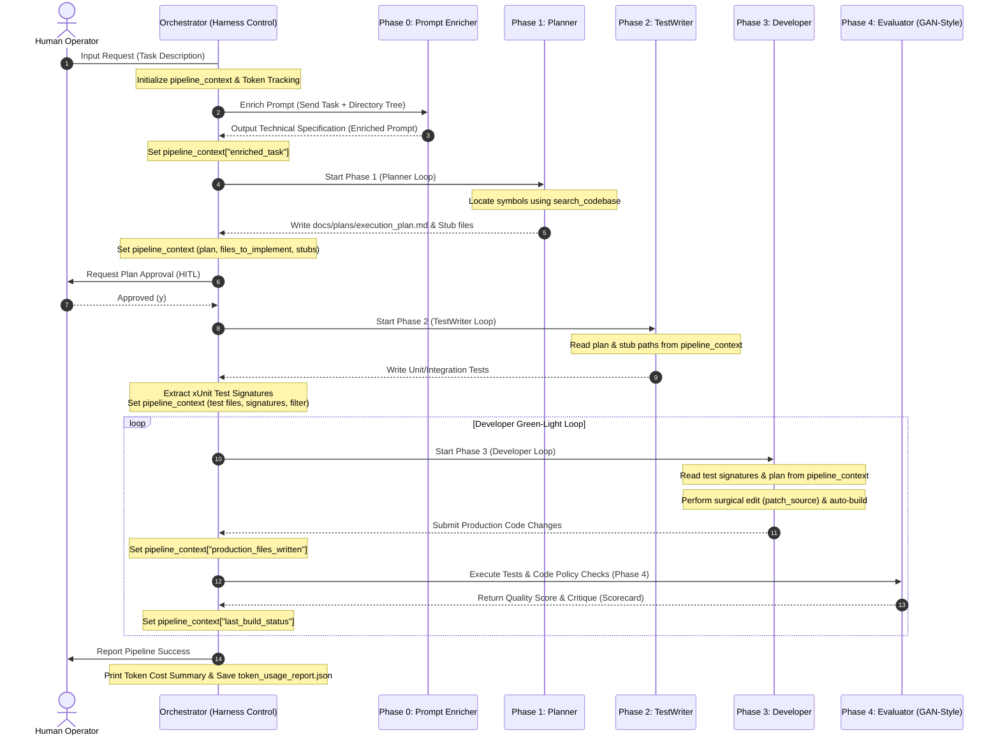

# TECHNICAL SPECIFICATION & ENGINEERING GUIDE: DUAL-HARNESS SYSTEM
This document serves as the official technical specification and operator guide for the **Dual-Harness** system in the `FloraCore` repository, comprising the **Inner Loop (AI Developer Harness)** and the **Outer Loop (Harness.io CI/CD)**.

---

## 1. System Overview & Architecture

The Dual-Harness architecture isolates developer iteration (Vòng lặp trong - Inner Loop) from integration/delivery (Vòng lặp ngoài - Outer Loop), ensuring both developer agility and production safety.

```text
+-----------------------------------------------------------------------------------+
|                                DUAL-HARNESS LIFE CYCLE                            |
+-----------------------------------------------------------------------------------+
|  [INNER LOOP - Local Sandbox]                                                     |
|  User Request --> Enricher --> Planner --> TestWriter --> Developer --> Evaluator |
|                                                                 |                 |
|  [OUTER LOOP - CI/CD Production]                                ▼                 |
|  Git Push / PR -----------------------------------------> Harness.io CI/CD       |
+-----------------------------------------------------------------------------------+
```

### 1.1. Inner Loop: AI Developer Harness (Local Agent)
An isolated sandbox environment wrapped around an LLM (such as Gemini, Claude, or OpenAI), providing controlled filesystem and system execution tools. It automates:
*   **Code Generation:** Scaffold Domain Entities, CQRS handlers, Validators, and Web Controllers based on Clean Architecture rules.
*   **Self-Healing Loop:** Executes builds and runs tests, parses raw compiler/test logs, and recursively refines code until it builds and passes all tests.

### 1.2. Outer Loop: Harness.io CI/CD (Production Delivery)
An enterprise SaaS CI/CD pipeline triggered by Git events. It manages:
*   **Verification Gate:** Runs full integration suites and static checks on clean, fresh runner instances.
*   **Security Scanning (STO):** Performs software composition analysis (SCA) and static application security testing (SAST).
*   **Production Deployment:** Builds Docker images and deploys them to Kubernetes clusters using GitOps connectors.

---

## 2. Directory & Source Code Structure

The Harness control scripts and modules are isolated within the `scripts/harness/` directory:

```text
scripts/harness/
├── __init__.py           # Package registration
├── orchestrator.py       # Central Pipeline Coordinator (AIDeveloperHarness)
├── llm/                  # Language Model Connectivity Layer
│   ├── __init__.py
│   ├── cache.py          # Shared Context Cache manager (Gemini)
│   ├── router.py         # Multi-provider LLM Client & token tracking callback
│   └── tool_schemas.py   # Function schemas in OpenAPI format
├── safety/               # Security and Recovery Layer
│   ├── __init__.py
│   ├── guardrails.py     # Path traversal filtration & secret leak prevention
│   └── rollback.py       # Git-based clean state rollback module
├── memory/               # Lesson Distillation Layer
│   ├── __init__.py
│   └── distiller.py      # Autonomously parses logs to extract harness lessons
└── tools/                # Local Sandbox Toolset
    ├── __init__.py
    ├── file_ops.py       # Paged reads, writes, codebase search, and patches
    ├── sandbox.py        # Sanitized system process execution shell
    └── diagnostics.py    # Regex-based compiler and test error parser
```

### 2.1. Component Matrix
| Component | File | Primary Responsibility |
| :--- | :--- | :--- |
| **Orchestrator** | `orchestrator.py` | Coordinates execution phases, initializes state context, enforces budget ceilings, and aggregates validation scores. |
| **LLM Router** | `llm/router.py` | Normalizes input/output formats across Gemini, Claude, and OpenAI APIs; handles backoffs; triggers token tracking callbacks. |
| **Guardrails** | `safety/guardrails.py` | Validates sandbox path safety and prevents leakage of sensitive configuration secrets. |
| **Diagnostics** | `tools/diagnostics.py` | Translates raw MSBuild / xUnit console output into structured error codes (`CSxxxx`) and test signatures. |
| **File Operations** | `tools/file_ops.py` | Implements high-precision codebase search (`search_codebase`) and surgical replacement editing (`patch_source`). |

---

## 3. Getting Started & Configuration

### 3.1. Prerequisites
Ensure Python 3.10+ and the required packages are installed in your environment:
```bash
pip install python-dotenv google-genai openai anthropic
```

### 3.2. API Key Configuration
Configure API credentials in your local `.env` file at the root of the project. The Harness automatically detects and instantiates clients:

```bash
# Configure Gemini API (Recommended for large-context codebases)
GEMINI_API_KEY=your_actual_gemini_api_key_here

# OR Anthropic Claude API
# CLAUDE_API_KEY=your_actual_claude_api_key_here

# OR OpenAI / DeepSeek API
# OPENAI_API_KEY=your_actual_openai_api_key_here
# DEEPSEEK_API_KEY=your_actual_deepseek_api_key_here
```

> [!NOTE]
> If no API keys are configured, the Harness starts in **Mock Mode** (Simulation) utilizing predefined responses to show the agent flow without incurring API costs.

---

## 4. Inner Loop Operation: AI Developer Harness

Run the Harness from the root directory of the project.

### 4.1. Command Line Interface (CLI)

#### Interactive Mode (Human-In-The-Loop - Default)
Prompts for user approval (`y/n`) before executing critical modifications (writing files, running commands):
```bash
python scripts/ai_developer_harness.py "Define a new entity ProductReview with rating and comment."
```

#### Autonomous Mode
Bypasses prompts for safe sandbox commands:
```bash
python scripts/ai_developer_harness.py "Define a new entity ProductReview..." --auto-approve
```

---

## 5. Security & Isolation Guardrails

To prevent the agent from executing malicious commands, leaking API credentials, or damaging system structures, the harness enforces three rings of security:

### 5.1. Path Traversal Protection
All file operations are validated via `is_path_safe`:
- Resolves target files using `os.path.commonpath`.
- Blocks operations targeting files outside the workspace root (e.g., `../../etc/passwd`).

### 5.2. Configuration Secret Isolation
- The file operations API explicitly blocks reads/writes targeting `.env`, `.env.example`, `appsettings.json`, and `appsettings.Development.json`.
- Agent attempts to access configuration files return a security error observation, keeping credentials out of public logs (`harness_run.log`).

### 5.3. Command Injection Filter
The sandbox runner processes system calls via list-based argument arrays without spawning shell interpreters. It cleans input commands and rejects delimiters: `;`, `&`, `|`, `` ` ``, `$`, `\n`, `\r`.

---

## 6. Loop Engineering Controls

The agent loop complies with **Loop Engineering standards** to guarantee cost efficiency, limit iteration budgets, and ensure structured transfer of specs.



### 6.1. Absolute Budget Ceiling Guard
To prevent infinite loops, the global loop counter `self.global_iteration_count` tracks iterations across all phases. It halts execution immediately if it exceeds the ceiling defined by `HARNESS_ABSOLUTE_MAX_ITER` (default: `120`).

### 6.2. Programmatic Token Tracking
- Hooks into LLM response metadata to track `prompt_tokens`, `candidates_tokens`, and `cached_content_tokens`.
- Calculates estimated API costs in real-time.
- Issues warnings at **80%** and **100%** of the cost limit (`HARNESS_COST_CEILING_USD`, default: `$5.0`).
- Generates a final JSON usage breakdown in `.claude/evals/token_usage_report.json`.

### 6.3. Structured Pipeline Handoff Context
Instead of passing unstructured chat logs, agents communicate using the `pipeline_context` state machine:
- **Planner → TestWriter:** `stub_files_created`, `files_to_implement`.
- **TestWriter → Developer:** `test_signatures` (auto-extracted from test files using regex) to prevent the Developer from guessing method signatures.
- **Developer → Evaluator:** `production_files_written`, `last_build_status`, `last_test_summary`.

### 6.4. High-Efficiency Tooling
*   **`search_codebase(query, file_glob)`**: Performs fast grep/ripgrep searches, preventing unnecessary full-file reads.
*   **`patch_source(file_path, search_text, replace_text)`**: Performs exact diff replacements, reducing output tokens by over 80% and triggering post-patch automatic builds.

---

## 7. Verification & Quality Gates

The `Evaluator` phase runs verification tools to check the modified code before submission.

### 7.1. Static Linting & Coding Policies
Ensures compliance with `CODING_POLICY.md` constraints:
*   Primary Constructors (C# 12+) must contain null checks (`ThrowIfNull` or `?? throw`).
*   Queries must be configured with `AsNoTracking` for read-only database contexts.
*   Async operations must accept `CancellationToken`.

### 7.2. Adversarial Scoring Matrix
The GAN Evaluator scores changes on a scale of **1.0 to 10.0**. The pipeline requires a score of **7.5+** to pass. If it fails, the changes are rolled back via git, and the critique is sent back to the developer as an observation.
- **Design Quality (0.3 Weight)**
- **Originality & Conventions (0.2 Weight)**
- **Craft & Polish (0.3 Weight)**
- **Functionality - Tests Pass Rate (0.2 Weight)**

### 7.3. Local Validation Suite (`final-check.ps1`)
Run the unified validation suite to check everything before pushing:
```powershell
powershell.exe -ExecutionPolicy Bypass -Command "./scripts/final-check.ps1 validate-all"
```

---

## 8. Outer Loop Operation: Harness.io CI/CD

The production pipeline is specified in `.harness/pipeline.yaml`.

```bash
# Workflow: Git Trigger -> Build Container -> Security scan -> Deploy K8s
```

### 8.1. Registering Connectors on Harness.io
Ensure the following connectors are configured under your Project Settings:
- `github_connector`: Link to the GitHub repository.
- `dockerhub_connector`: Repository destination for release images.
- `k8s_cluster_connector`: Target cluster credentials for deployment.

### 8.2. Safety Guidelines
Never grant write permissions to the master branch (`main`) directly to the AI Agent. The agent must create feature branches (`feature/*`) and submit Pull Requests. **Harness.io CI** remains the final verification gate before merging code to release branches.